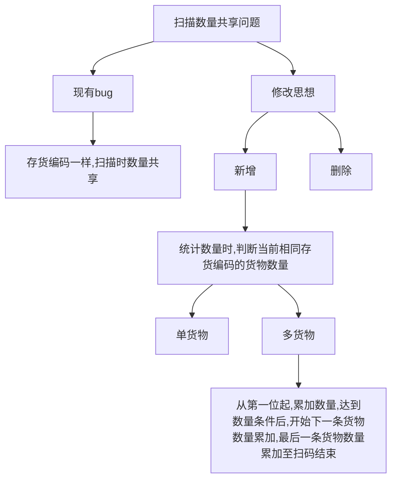

# 代码积累

[TOC]

## 序言

 2021年4月13日早九点
 客户安伴反馈`采购入库模块扫描时数量共享`,
 回想当时校验规则, 只匹配了订单中存货与扫描时的存货的编码和批次,
 在安伴项目中, 扫描时`批次`是空的, 如果存货编码一致, 每一条存货的扫描数量就会出现共享bug,
 于是开始着手修改,
 思路是这样的


 想法很清晰, 于是开始着手实现
 结果下午三点左右才解决完成.....
 
 具体细节就不说了, 这次问题解决让我深切认识到自己对于`数据处理`这块的不足, 所以
 开始这个笔记, 记录些平时会用到的相关方法, 方便下次使(偷)用(懒)。

## 字符串

## 数组

### 数组对象去重

方法0: 根据一个或多个键值去重

``` js
let arr = [{key: '01',value: '',age: 18,name: '乐乐'},{key: '01',value: '1',age: 18,name: '乐乐'}, {key: '02',value: '',age: 21,name: '博博'}, {key: '02',value: '',age: 18,name: '博博'}];
var dicts = {};
for (const item of arr) {
	dicts[item.key + ',' + item.name + ',' + item.value] = item;
}
arr = Object.values(dicts);
console.log(arr);
```

备注: `Object.values()` 方法返回一个給定对象自身的所有可枚举属性值的数组, 值的顺序与使用 `for...in` 循环一致(区别在于 `for-in` 循环枚举原型链中的属性), 上面代码根据保存指定键值, 使其相同的覆盖, 然后相当于去重.


## 对象


