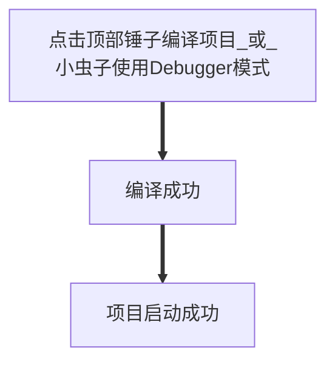

# IDEA 项目启动配置示例

<a href="#idea-项目启动配置示例" class="go-top"> ↑ </a>

↓收起菜单

[TOC]

## 一、Idea 中配置指定项目关联 svn

### 1.1 寻找项目svn URL地址

 svn服务器上项目地址: 例: `http://hzya.ufyct.com:9095/svn/JAVAProject/KF2020307杭州望家欢生鲜配送ERP/code/freshdelivery`

### 1.2 idea配置svn代码地址

 打开 idea 远程仓库控制台

 选择 svn; ② 添加远程仓; ③ 添加远程仓地址

## 二、配置IDEA项目

 打开 idea ‘项目结构’ 面板(快捷键: Ctrl + Shift + Alt + S)

 `E:\hzya-projects\ideawork\freshdelivery\target` 面板中选择 ‘Project’ 选择当前项目目录, 指定项目编译成功后的代码生成目录

 下一步来到 ‘Module’, 防止程序定向不到预定编译输出文件夹, 先删除已存在的配置

 下一步来到 ‘Artifacts(工件)’ – 删除第一个 war 配置

 添加 ‘Module’ – 选择 ‘Web(因为当前是 web 项目)’ – 右下角自动创建工件

 回到 ‘Artifacts’ – 右侧 ‘Available Elements(可用元素)’ – 选中已有项目文件夹 – Put into Output Root(放入输出根)

## 三、添加 tomcat 服务

 顶部锤子 旁边 - Edit Configurations 配置服务

 左上角添加 tomcat  – Tomcat Server – tomcat-local  - 会将面板替换成下图

 配置相关服务器信息(name、端口等), 点击右下角 ‘fix’, 自动导入需要部署的项目

 再来到 ‘Deployment(部署)’ – 配置 ‘Application content’ – 配置 Web 项目访问路径

 启动实时文件更新到前台(文件热加载)

 点击顶部锤子 编译项目(或者小虫子使用 Debugger 模式)

